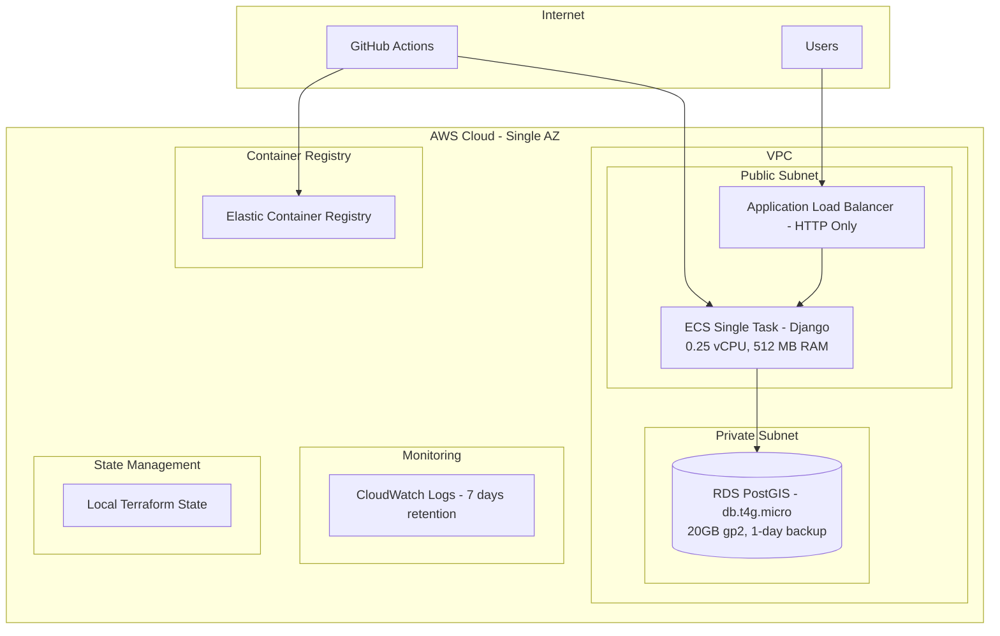
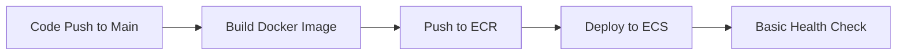

# AWS Infrastructure Design Document

## Overview

This design document outlines an ultra-cost-optimized AWS infrastructure for the Spontime POC. The architecture uses the absolute minimum AWS services with the smallest possible instance sizes to minimize operational expenses while providing basic functionality for proof-of-concept testing.

The design prioritizes extreme cost optimization by eliminating Redis/Celery, using single-AZ deployment, minimal instance sizes, avoiding expensive services like NAT Gateway, and using local Terraform state for simplicity. This approach is specifically designed for POC development and demo purposes rather than production workloads.

## Architecture

### High-Level Architecture



### Ultra Cost Optimization Strategy

1. **Compute Optimization**
   - Use smallest possible ECS Fargate tasks (0.25 vCPU, 512 MB RAM)
   - Single ECS task with no auto-scaling to minimize compute costs
   - Leverage AWS Free Tier eligible services where possible

2. **Storage Optimization**
   - Use smallest RDS instance (db.t4g.micro) with minimal storage (20GB gp2)
   - 1-day backup retention to minimize storage costs
   - 7-day CloudWatch log retention to reduce logging costs

3. **Network Optimization**
   - No NAT Gateway - ECS tasks in public subnets with direct internet access
   - Single AZ deployment to avoid cross-AZ data transfer costs
   - HTTP-only ALB (no HTTPS/SSL certificates) for POC simplicity

4. **Infrastructure Management**
   - Local Terraform state file for simplicity (no S3/DynamoDB costs)
   - Single environment deployment to avoid complexity
   - Minimal IAM roles with basic permissions only

## Components and Interfaces

### 1. Networking Layer

**VPC Configuration:**

- CIDR: 10.0.0.0/16
- Single Availability Zone for cost optimization
- Public subnet: 10.0.1.0/24 (for ALB and ECS tasks)
- Private subnet: 10.0.10.0/24 (for RDS only)
- Internet Gateway with route table for public subnet

**Security Groups:**

- ALB Security Group: Allow HTTP (port 80) from internet (0.0.0.0/0)
- ECS Security Group: Allow traffic from ALB security group only
- RDS Security Group: Allow PostgreSQL (port 5432) from ECS security group only

### 2. Application Layer

**ECS Cluster Configuration:**

- Fargate launch type for serverless container management
- Single task deployment with no auto-scaling
- Basic rolling update deployment strategy

**Task Definition:**

- Django API Task: 256 CPU (0.25 vCPU), 512 MB Memory
- Single container running Django application
- No Celery workers or Redis to minimize costs

**Scaling Configuration:**

```text
POC Environment:
- Desired count: 1 task
- Min: 1 task, Max: 1 task
- No auto-scaling policies
```

### 3. Database Layer

**RDS PostGIS Configuration:**

- Engine: PostgreSQL 15 with PostGIS extension
- Instance class: db.t4g.micro (Free Tier eligible)
- Storage: gp2 with 20GB initial allocation
- Single-AZ deployment for cost optimization
- Automated backups with 1-day retention to minimize costs
- No encryption at rest to avoid additional charges

**No Redis/ElastiCache:**

- Eliminated to minimize costs for POC
- Django will handle caching in-memory or use database-backed sessions

### 4. Load Balancing

**Application Load Balancer:**

- Internet-facing with HTTP listener only (no SSL for POC)
- Health checks on Django /health endpoint
- Single target group pointing to ECS service
- Basic health check configuration (30-second intervals)

**No DNS Configuration:**

- No Route 53 hosted zone to avoid DNS costs
- Access via ALB DNS name for POC testing
- No custom domain or SSL certificates

### 5. Container Registry

**ECR Repository:**

- Private repository for Django Docker images
- Basic lifecycle policy to retain last 5 images
- No image scanning to avoid additional costs
- Simple repository for POC deployment

## Data Models

### Infrastructure State Management

**Terraform State:**

- Local state file (terraform.tfstate) for simplicity
- No remote backend to avoid S3/DynamoDB costs
- Manual state management suitable for POC
- Easy to recreate infrastructure if state is lost

**Configuration Variables:**

```hcl
variable "app_name" {
  description = "Application name for resource naming"
  type        = string
  default     = "spontime-poc"
}

variable "aws_region" {
  description = "AWS region for deployment"
  type        = string
  default     = "us-east-1"
}

# Fixed resource sizes for ultra-cost optimization
locals {
  rds_instance_class = "db.t4g.micro"
  ecs_cpu           = 256
  ecs_memory        = 512
}
```

### Application Configuration

**ECS Task Environment Variables:**

- DATABASE_URL: RDS PostgreSQL connection string
- SECRET_KEY: Simple environment variable (not Secrets Manager for POC)
- DEBUG: Set to "True" for POC development
- ALLOWED_HOSTS: ALB DNS name and localhost

## Error Handling

### Infrastructure Resilience

1. **Basic Availability:**
   - Single-AZ deployment for cost optimization
   - ECS service will restart failed tasks automatically
   - ALB health checks with automatic task replacement

2. **No Auto Scaling:**
   - Fixed single task deployment
   - Manual scaling if needed during POC testing
   - Simplified configuration without scaling policies

3. **Basic Backup and Recovery:**
   - RDS automated backups with 1-day retention
   - Local Terraform state (easily recreatable)
   - Infrastructure-as-code for disaster recovery

### Application Error Handling

1. **Basic Health Checks:**
   - ALB health check endpoint: `/health`
   - ECS health check with 30-second intervals
   - Simple HTTP 200 response validation

2. **Minimal Logging Strategy:**
   - CloudWatch Logs for ECS tasks only
   - Basic application logging
   - 7-day log retention to minimize costs

3. **Basic Monitoring:**
   - Default CloudWatch metrics for ECS and RDS
   - No custom alarms to avoid additional costs
   - Manual monitoring during POC development

## Testing Strategy

### Infrastructure Testing

1. **Basic Terraform Validation:**
   - `terraform validate` for syntax checking
   - `terraform plan` for change preview
   - Manual review of resource configurations

2. **Minimal Security:**
   - Basic security group configurations
   - IAM roles with minimal required permissions
   - No additional security scanning tools to avoid complexity

3. **Cost Monitoring:**
   - Manual cost monitoring through AWS console
   - Simple resource tagging for identification
   - No automated cost alerts to avoid additional charges

### Deployment Testing

1. **Simple Rolling Deployment:**
   - ECS service update with basic rolling deployment
   - Health check validation before marking tasks healthy
   - Manual rollback if issues are detected

2. **Single Environment:**
   - POC environment only
   - Manual testing and validation
   - Simple deployment process without complex promotion

### CI/CD Pipeline Design

**GitHub Actions Workflow:**



**Simple Pipeline Stages:**

1. **Build Stage:** Build and tag Docker image
2. **Push Stage:** Push image to ECR
3. **Deploy Stage:** Update ECS service with new image
4. **Verify Stage:** Basic health check validation

**Simple Security:**

- AWS credentials via GitHub secrets (access key/secret key)
- No complex OIDC setup to maintain simplicity
- Basic IAM permissions for ECR and ECS operations

This design provides an ultra-cost-optimized AWS infrastructure specifically tailored for POC development and testing. The architecture prioritizes minimal costs over high availability and scalability, making it ideal for proof-of-concept development while maintaining basic security and functionality. The infrastructure can be easily recreated and is designed to be straightforward to deploy and manage during the development phase.